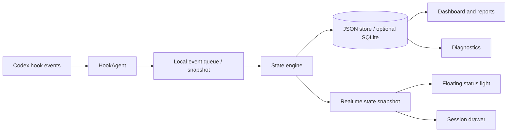

# 通用 AI / Agent 交通信号灯产品设计方案

## 1. 产品定位

本方案基于当前 `codex-traffic-light` 的设定，设计一个同类型但更合理、更可维护、更适合长期扩展的产品。

建议产品名：

```text
AI Traffic Signal
Agent Signal Light
WaitSignal
Task Signal
Work Signal
```

中文名可选：

```text
AI 交通信号灯
Agent 信号灯
等待信号灯
任务信号灯
工作信号灯
```

产品定位：

```text
一个纯本地运行的 AI / Agent 等待状态信号灯。
它通过不同适配器采集 AI 工具、Agent、网站或 CLI 的运行事件，维护本地会话状态，并用交通红绿灯 UI 展示“处理中、等待用户、已完成”等状态。
```

Codex 只是第一阶段适配对象，不是产品名称和产品边界。后续应能部署到其他需要等待或确认的 AI 网站、Agent 工具、CLI、IDE 插件和自动化系统上。

它不是某个 AI 工具的替代入口，也不是远程服务，而是一个通用的本地状态提醒层。

## 2. 设计目标

新产品需要解决三个核心问题：

1. 让用户一眼知道某个 AI / Agent 当前是否正在处理任务。
2. 让用户及时发现某个 AI / Agent 是否正在等待用户输入、权限确认或人工接管。
3. 让多网站、多工具、多项目、多会话、多入口同时运行时的状态更加清晰。

同时，新产品要避免当前项目中已经暴露出的可维护性问题：

- 中文文案编码损坏。
- PowerShell hook 脚本过长且内联在 C# 字符串中。
- hook 脚本直接承担过多业务判断。
- 状态协议过于简单，缺少 schema version。
- 统计口径和多会话聚合口径容易混淆。
- 诊断能力偏隐藏，不够产品化。

额外的关键约束：

```text
足够通用。
任意 Codex 入口都能接入。
其他 AI 网站或 Agent 也能通过适配器接入。
任意项目目录、任意浏览器页面或任意 Agent 会话都能使用。
不要求用户安装过多依赖。
首次配置后，日常使用应接近无感。
```

因此，本产品应优先采用“便携版优先”的设计，而不是一开始就依赖后台服务、数据库服务或复杂安装流程。

## 3. 核心设计原则

### 3.1 hooks 只负责采集事件

适配器不应该直接决定最终 UI 状态。Codex hooks、浏览器脚本或 CLI 包装器都只负责把事件和上下文可靠写出去。

推荐原则：

```text
Adapters = event collectors
Core state engine = state decision maker
UI = state renderer
```

### 3.2 事件和状态分离

原始事件和展示状态必须分开。

事件表示“发生了什么”：

```text
UserPromptSubmit
PermissionRequest
Stop
SessionStart
```

状态表示“当前应该如何展示”：

```text
Thinking
Waiting
Completed
Idle
Failed
Stale
Unknown
```

这样可以让系统后续支持更多事件，而不破坏 UI 逻辑。

### 3.3 本地优先

所有核心数据保存在本地。默认不上传用户数据，不依赖服务器。

可访问网络的功能只允许用户主动触发，例如：

- 检查更新。
- 打开 GitHub Release 页面。

### 3.4 诊断能力产品化

hook 工具最常见的问题不是 UI，而是：

- hook 没有被信任。
- hook 没有触发。
- `CODEX_HOME` 不一致。
- session id 不稳定。
- 工作目录识别失败。
- PowerShell 脚本执行失败。

因此诊断页应该是一等功能，而不是只把诊断文件藏在目录里。

### 3.5 便携版优先

产品应该可以以一个目录或一个安装包形式分发，用户不需要手动安装 .NET Runtime、数据库、Node.js、Python 或其他额外组件。

推荐发布形态：

```text
SignalLight/
  SignalLight.App.exe
  SignalLight.Agent.exe
  hooks/
    codex-hook.ps1
```

其中：

- `App.exe` 是自包含桌面程序。
- `Agent.exe` 是自包含本地事件写入器。
- PowerShell 脚本只依赖 Windows 自带 PowerShell。

如果目标仍然是 Windows，推荐使用 .NET self-contained publish。这样用户不需要提前安装 .NET 运行时。

### 3.6 一次配置，到处使用

工具不应该要求每个项目都安装一次。合理方式是：

```text
安装 / 解压一次
写入一次 Codex hooks
信任一次 hooks
之后任意项目中运行 codex 都自动接入
```

在其他项目里，用户只需要正常执行：

```powershell
codex
```

如果用户希望任务名更清楚，再可选使用包装命令：

```powershell
signal-light run --name "项目名称"
```

包装命令是增强体验，不应该是必需入口。

## 4. 总体架构

当前项目的链路是：

```text
Codex hooks -> PowerShell 脚本 -> JSON 文件 -> WPF 文件监听 -> 红绿灯 UI
```

新产品建议升级为：

```text
Codex hooks
  -> HookAgent 事件写入器
  -> 本地事件队列 / 状态快照
  -> Core 状态引擎
  -> 轻量本地存储
  -> Desktop UI / Tray / Diagnostics
```

推荐架构图：



为了降低依赖，MVP 不引入常驻后台服务。App 启动时负责监听状态快照和事件队列；App 未启动时，HookAgent 仍然可以把事件写入本地文件，等 App 下次启动后再读取。

## 5. 工程结构建议

```text
SignalLight/
  src/
    SignalLight.App/
      WPF 或 WinUI 桌面 UI

    SignalLight.Core/
      状态机
      会话聚合
      统计逻辑
      设置模型
      存储接口

    SignalLight.Agent/
      本地事件写入器
      接收 hooks、浏览器扩展、CLI 包装器、通用命令上报

    SignalLight.Adapters/
      Codex hooks 适配器
      Browser userscript / extension 适配器
      CLI wrapper 适配器
      Generic event 适配器

    SignalLight.HookScripts/
      PowerShell hook 模板，主要服务 Codex / CLI
      不内联在 C# 大字符串里

    SignalLight.Storage/
      SQLite 实现
      JSON fallback 实现

  tests/
    Core.Tests/
    HookAgent.Tests/
    Storage.Tests/
    App.SmokeTests/

  installer/
    Inno Setup 或 MSIX 安装脚本

  docs/
    用户指南
    hook 协议
    状态模型
    诊断手册
```

## 6. 技术选型

| 模块 | 推荐技术 | 说明 |
|---|---|---|
| 桌面 UI | .NET 8 WPF 或 WinUI 3 | WPF 更成熟，WinUI 视觉更现代 |
| 核心逻辑 | .NET 类库 | 状态机、聚合、统计必须可单测 |
| Local Agent | .NET console exe | 接收各类适配器事件，替代复杂脚本业务逻辑 |
| Codex hook 脚本 | PowerShell 模板 | 只负责调用 Local Agent 或写 fallback 事件 |
| Browser adapter | 浏览器扩展 / userscript | 后续接入 AI 网站等待状态 |
| 默认存储 | JSON 文件 | 零依赖，便于调试和迁移 |
| 可选存储 | SQLite | 适合历史事件和统计增强版 |
| UI 通知 | FileSystemWatcher / named pipe | MVP 可用文件监听，后续可升级 |
| 安装器 | Inno Setup / MSIX | Inno Setup 简单，MSIX 更规范 |
| 测试 | xUnit | Core 行为和协议必须覆盖 |

MVP 推荐避免引入 SQLite 作为必需依赖。SQLite 可以作为第二阶段增强能力，用于长期历史、统计查询和项目报表。

## 6.1 通用接入模式

产品需要支持三种使用模式，从低门槛到增强体验逐级递进。

### 模式 A：Codex 全局 hooks 模式

这是第一阶段默认模式。

```text
用户启动 App
App 写入 %CODEX_HOME%\hooks.json
用户在 Codex 里 /hooks 信任一次
之后任意目录运行 codex 都自动上报状态
```

优点：

- 不需要每个项目配置。
- 不需要改变用户原来的 `codex` 使用习惯。
- 适合“任意 Codex，在任何地方使用”的目标。

### 模式 B：便携脚本模式

给不想安装的用户提供一个脚本：

```powershell
.\install-hooks.ps1
```

脚本只做：

- 找到当前工具目录。
- 写入 hooks。
- 输出 `/hooks` 信任提示。

用户可以把整个目录复制到其他电脑，再运行一次脚本。

### 模式 C：包装命令增强模式

可选提供：

```powershell
signal-light run --name "项目名称"
```

它实际做的是：

- 设置本次会话环境变量。
- 注入更稳定的 session id。
- 注入更友好的任务名。
- 调用原始 `codex`。

该模式只用于改善多会话识别，不作为基础使用前提。

### 模式 D：通用事件上报模式

为后续其他 AI 网站或 Agent 预留统一入口：

```text
signal-agent emit --source browser --state waiting --title "ChatGPT" --session "tab-123"
signal-agent emit --source cli --state running --title "AutoAgent"
signal-agent emit --source webhook --state completed --title "Batch Agent"
```

任何工具只要能调用命令或写 JSON，就可以接入。

### 模式 E：浏览器适配模式

后续面向 AI 网站，例如：

```text
ChatGPT
Claude
Gemini
Perplexity
自建 Agent Web UI
```

接入方式可以是：

- 浏览器扩展。
- userscript。
- 本地 companion bridge。

浏览器适配器只负责识别网页上的“正在生成、需要确认、完成、报错”等状态，再上报给 Local Agent。

## 7. 状态模型

### 7.1 原始事件模型

事件是系统的输入。每次 hook 触发，都生成一条事件。

```json
{
  "schemaVersion": 1,
  "eventId": "550e8400-e29b-41d4-a716-446655440000",
  "eventType": "TaskStarted",
  "sessionId": "codex-session-id",
  "conversationId": "conversation-id",
  "source": "codex-cli",
  "adapter": "codex-hooks",
  "workspace": "B:\\project",
  "title": "修复登录接口报错",
  "processId": 12345,
  "processStartTime": "2026-06-03T14:20:00+08:00",
  "createdAt": "2026-06-03T14:30:00+08:00",
  "payload": {}
}
```

字段说明：

| 字段 | 说明 |
|---|---|
| `schemaVersion` | 协议版本，便于未来升级 |
| `eventId` | 事件唯一 ID |
| `eventType` | 通用事件类型 |
| `sessionId` | 稳定会话 ID，可来自 CLI、浏览器 tab、Agent run id |
| `conversationId` | 原始会话或对话 ID |
| `source` | `codex-cli`、`vscode-plugin`、`browser`、`web-agent`、`cli-agent` 或 `unknown` |
| `adapter` | `codex-hooks`、`browser-extension`、`userscript`、`cli-wrapper`、`generic` |
| `workspace` | 当前工作目录；浏览器场景可为空 |
| `title` | 任务标题、网页标题或用户输入预览，需截断 |
| `processId` | 相关进程 ID；浏览器场景可为空 |
| `processStartTime` | 进程启动时间，用于辅助去重 |
| `createdAt` | 事件创建时间 |
| `payload` | 预留扩展字段 |

### 7.2 展示状态模型

内部状态不直接使用红黄绿，而使用更明确的业务状态：

| 状态 | 含义 | 默认灯色 |
|---|---|---|
| `Idle` | 没有活跃任务 | 绿 |
| `Thinking` | AI / Agent 正在处理 | 红 |
| `Waiting` | 等待权限确认 | 黄 |
| `Completed` | 任务刚完成 | 绿 |
| `Failed` | hook 或任务出现异常 | 灰 / 红闪 |
| `Stale` | 状态过期，不可信 | 灰 |
| `Unknown` | 无法判断状态 | 灰 |

这样 UI 可以继续保持红黄绿的直观表达，但内部模型更准确。

## 8. hooks 设计

### 8.1 Codex hook 事件映射

| Codex 事件 | 原始事件 | 默认状态影响 |
|---|---|---|
| `SessionStart` | `SessionStarted` | `Idle` |
| `UserPromptSubmit` | `PromptSubmitted` | `Thinking` |
| `PermissionRequest` | `PermissionRequested` | `Waiting` |
| `Stop` | `RunStopped` | `Completed` |

后续可以扩展：

| 事件 | 用途 |
|---|---|
| `Error` | 进入 `Failed` |
| `ToolStart` | 展示当前工具调用 |
| `ToolEnd` | 展示工具调用完成 |

具体是否支持取决于 Codex hooks 实际事件能力。

### 8.1.1 通用事件映射

面向其他 AI 网站或 Agent，统一使用通用事件：

| 通用事件 | 默认状态影响 | 适用场景 |
|---|---|---|
| `TaskStarted` | `Thinking` | 开始生成、开始执行任务 |
| `UserActionRequired` | `Waiting` | 等待权限、等待确认、等待输入 |
| `TaskCompleted` | `Completed` | 生成结束、任务完成 |
| `TaskFailed` | `Failed` | 执行失败、页面报错 |
| `Heartbeat` | 保活 | 长任务仍在运行 |
| `SessionEnded` | `Completed` / `Idle` | 会话结束 |

Codex 适配器只是把 Codex hook 事件转换为这些通用事件。浏览器扩展、userscript、其他 CLI Agent 也应转换到同一组通用事件。

### 8.2 PowerShell hook 模板

PowerShell 脚本应该尽量短，只做转发：

```powershell
param(
    [Parameter(Mandatory=$true)]
    [string]$EventType
)

$rawInput = [Console]::In.ReadToEnd()
$agent = Join-Path $env:SIGNAL_LIGHT_HOME "SignalLight.Agent.exe"

if (Test-Path -LiteralPath $agent) {
    & $agent --event $EventType --stdin-json $rawInput
    exit $LASTEXITCODE
}

# Fallback: write event json to local queue
```

业务逻辑放在 HookAgent 中，而不是 PowerShell 中。

### 8.3 Local Agent 职责

Local Agent 是一个小型命令行程序，职责包括：

- 读取 stdin 中的 Codex hook JSON。
- 接收通用 `emit` 命令。
- 接收浏览器扩展或 userscript 的本地事件。
- 解析 `session_id`、`conversation_id`、`cwd`、`prompt`。
- 获取父进程和来源。
- 生成事件 ID。
- 写入事件队列。
- 写入诊断结果。
- 返回明确退出码。

Local Agent 不负责 UI，也不直接决定最终主灯状态。

## 9. 本地存储设计

为了满足低依赖和便携要求，MVP 推荐使用 JSON 文件作为主存储。SQLite 作为增强版能力，而不是基础依赖。

### 9.1 MVP JSON 存储

推荐目录：

```text
%LOCALAPPDATA%\SignalLight\
  state.json
  settings.json
  sessions\
    <session-id>.json
  events\
    <timestamp>-<event-id>.json
  diagnostics\
    latest-hook-context.json
```

其中：

- `state.json` 保存当前聚合状态快照。
- `sessions\*.json` 保存每个会话的最新状态。
- `events\*.json` 保存短期事件队列。
- `diagnostics\latest-hook-context.json` 保存最近一次 hook 诊断信息。

事件文件可以定期清理，避免长期膨胀。

### 9.2 可选 SQLite 表结构

```sql
CREATE TABLE sessions (
    id TEXT PRIMARY KEY,
    source TEXT NOT NULL,
    workspace TEXT NOT NULL,
    display_name TEXT NOT NULL,
    current_state TEXT NOT NULL,
    process_id INTEGER,
    process_start_time TEXT,
    started_at TEXT NOT NULL,
    updated_at TEXT NOT NULL,
    ended_at TEXT
);

CREATE TABLE events (
    id TEXT PRIMARY KEY,
    session_id TEXT NOT NULL,
    event_type TEXT NOT NULL,
    payload_json TEXT NOT NULL,
    created_at TEXT NOT NULL
);

CREATE TABLE daily_stats (
    date TEXT PRIMARY KEY,
    thinking_count INTEGER NOT NULL DEFAULT 0,
    completed_count INTEGER NOT NULL DEFAULT 0,
    waiting_count INTEGER NOT NULL DEFAULT 0,
    thinking_duration_ms INTEGER NOT NULL DEFAULT 0
);
```

### 9.3 fallback 策略

即使 HookAgent 不可用，PowerShell 也可以写入最小事件文件：

```text
%LOCALAPPDATA%\SignalLight\events\*.json
%LOCALAPPDATA%\SignalLight\diagnostics\latest-hook-context.json
```

桌面 UI 启动后可以导入这些 fallback events。这样即使部分组件缺失，也不会完全失效。

## 10. 状态引擎

状态引擎负责把事件流转换为 session 状态。

规则示例：

```text
SessionStarted      -> Idle
PromptSubmitted     -> Thinking
PermissionRequested -> Waiting
RunStopped          -> Completed
timeout             -> Stale
hook error          -> Failed
```

多会话主状态聚合优先级：

```text
Waiting > Failed > Thinking > Completed > Idle > Stale > Unknown
```

原因：

- `Waiting` 最需要用户立即处理。
- `Failed` 需要用户查看诊断。
- `Thinking` 表示后台正在工作。
- `Completed` 和 `Idle` 不需要紧急关注。
- `Stale` 和 `Unknown` 说明状态可信度低。

## 11. 会话可见性规则

建议默认规则：

| 状态 | 默认保留时间 | 进程存活时 |
|---|---:|---|
| `Completed` | 5 分钟 | 不延长 |
| `Waiting` | 5 分钟 | CLI 最长 6 小时，VS Code 插件最长 2 小时 |
| `Thinking` | 10 分钟 | CLI 最长 6 小时，VS Code 插件最长 2 小时 |
| `Failed` | 30 分钟 | 可手动清除 |
| `Stale` | 30 分钟 | 可手动清除 |

用户可以在设置中调整：

- 是否显示已完成会话。
- 旧会话保留多久。
- 是否自动清理历史事件。

## 12. UI 设计

### 12.1 悬浮迷你状态灯

第一层 UI 是悬浮状态灯。

示例：

```text
[黄] 1/3
```

显示内容：

- 当前最高优先级状态。
- 已完成会话数 / 当前可见会话数。
- 点击后展开任务抽屉。

### 12.2 任务抽屉

第二层 UI 是当前会话列表。

示例：

```text
等待权限    MES 主项目       2m ago
处理中      医疗评分系统     18s ago
已完成      文档生成工具     4m ago
```

每行显示：

- 状态标签。
- 项目名或任务名。
- 工作目录尾部。
- 更新时间。
- 来源：CLI 或 VS Code。

### 12.3 完整控制面板

第三层 UI 是完整面板。

包含：

- 当前活跃会话。
- 今日统计。
- 本周统计。
- 最近事件流。
- hook 安装状态。
- 诊断信息。
- 设置。

建议不要把所有内容塞进悬浮窗。悬浮窗只负责提醒，完整面板负责解释。

## 13. 托盘菜单设计

托盘菜单建议包含：

```text
显示 / 隐藏状态灯
打开控制面板
重新安装 hooks
检查 hook 信任状态
打开诊断页
清理已完成会话
暂停提醒
设置
关于
退出
```

手动切灯不建议作为主功能。更合理的是提供“暂停提醒”和“模拟事件”：

- 暂停提醒：用于用户暂时不想被打扰。
- 模拟事件：用于调试 hook 和 UI。

## 14. 首次启动引导

新产品应该有明确的首次启动流程：

```text
1. 检测 Codex 配置目录或通用应用目录
2. 检测 hooks.json 是否存在
3. 写入或更新 hooks 配置
4. 如果使用 Codex 适配器，显示需要在 Codex 中运行 /hooks
5. 等待用户信任 hooks
6. 监听首次 hook 触发
7. 显示安装完成或诊断错误
```

引导页需要显示：

```text
Codex 配置目录或通用应用目录
hooks.json 路径
hook 脚本路径
HookAgent 路径
最近一次 hook 触发时间
当前 CODEX_HOME
```

这比只弹一个提示框更可靠。

## 15. 诊断页设计

诊断页应该包含：

```text
基础信息
- 应用版本
- CODEX_HOME
- 当前用户
- 当前存储路径

hooks 状态
- hooks.json 是否存在
- 是否包含本产品 hook
- hook 脚本是否存在
- HookAgent 是否存在

最近事件
- 最近一次 hook 触发时间
- 最近一次 eventType
- 最近一次 sessionId
- 最近一次 workspace
- 最近一次错误

操作
- 重新写入 hooks
- 打开配置目录
- 导出诊断包
- 复制诊断信息
```

诊断页是产品可靠性的关键。

## 16. 统计设计

建议统计分为两层：

### 16.1 全局统计

```text
今日请求次数
今日完成次数
今日等待权限次数
今日总处理时长
本周总处理时长
平均处理时长
```

### 16.2 项目统计

```text
项目名
请求次数
完成次数
等待权限次数
处理时长
最近活跃时间
```

注意：统计要明确口径。

推荐文案：

```text
处理时长按会话状态估算，仅用于本地活动参考。
```

## 17. 设置项设计

建议设置项：

```text
外观
- 深色 / 浅色
- 单灯 / 三灯
- 动画效果
- 窗口置顶

提醒
- 等待权限时自动展开
- 等待权限时声音提醒
- 长时间处理中提醒
- 暂停提醒时长

会话
- 显示已完成会话
- 已完成会话保留时间
- 自动清理历史

隐私
- prompt 预览开关
- prompt 预览最大长度
- 是否保存事件历史

诊断
- 详细日志
- 导出诊断包
```

## 18. MVP 范围

第一版不要做太大。建议 MVP 只包含：

- WPF 悬浮状态灯。
- HookAgent。
- PowerShell hook 模板。
- hooks 安装和重写。
- `/hooks` 信任引导。
- 单会话状态显示。
- 多会话任务抽屉。
- JSON 主存储。
- 基础诊断页。
- 托盘菜单。
- 自包含发布包。
- 便携安装脚本。

SQLite、历史报表、项目统计可以放到第二阶段。

## 19. 版本路线

### 阶段 1：基础可用

```text
hooks 安装
事件写入
单会话状态显示
托盘退出
基础诊断页
```

### 阶段 2：多会话

```text
sessionId 识别
任务抽屉
状态聚合
过期清理
项目名称显示
```

### 阶段 3：统计和设置

```text
可选 SQLite 存储
今日 / 本周统计
主题设置
提醒设置
历史记录
```

### 阶段 4：发布质量

```text
安装器
自动更新
错误诊断
端到端测试
用户文档
```

## 20. 测试策略

Core 层必须覆盖：

- 事件解析。
- 状态机转换。
- 多会话聚合。
- 会话过期规则。
- session 去重。
- 统计计算。
- 设置读写。

HookAgent 必须覆盖：

- stdin JSON 解析。
- 缺失字段兼容。
- `CODEX_HOME` 路径选择。
- fallback JSON 写入。
- 诊断输出。

安装器和 hooks 必须覆盖：

- 保留用户已有 hooks。
- 幂等安装。
- 坏 `hooks.json` 备份。
- hook 脚本存在性。
- HookAgent 路径正确性。

UI 至少做 smoke test：

- 应用可启动。
- 状态灯可显示。
- 模拟事件后状态变化。
- 任务抽屉可展开。
- 诊断页可打开。

## 21. 和当前项目的差异

| 当前项目 | 新方案 |
|---|---|
| hooks 直接写状态 | hooks 写事件，状态引擎聚合 |
| PowerShell 脚本包含大量业务逻辑 | PowerShell 只转发，HookAgent 处理逻辑 |
| 多个 JSON 文件承担状态存储 | MVP 继续使用 JSON，但协议化；SQLite 作为可选增强 |
| 红黄绿即内部状态 | 内部状态更细，UI 再映射颜色 |
| 诊断文件隐藏在目录 | 诊断页产品化 |
| 手动切灯是菜单功能 | 暂停提醒和模拟事件更合理 |
| 中文编码已出现损坏 | 全项目统一 UTF-8 |

## 21.1 低依赖分发方案

为了做到“任意 AI / Agent、任何地方、方便使用”，推荐最终分发形态如下：

```text
SignalLight-Portable.zip
  SignalLight.App.exe
  SignalLight.Agent.exe
  install-hooks.ps1
  uninstall-hooks.ps1
  hooks\codex-hook.ps1
  README.md
```

用户操作：

```powershell
Expand-Archive SignalLight-Portable.zip
.\install-hooks.ps1
.\SignalLight.App.exe
```

然后在 Codex 中执行一次：

```text
/hooks
```

信任后，任意项目目录直接运行：

```powershell
codex
```

即可自动接入。

对于想要安装到开始菜单的用户，再额外提供安装器版本。安装器不应该是唯一分发方式。

## 22. 关键风险

### 22.1 Codex hooks 事件能力变化

如果 Codex hooks 的事件名、输入 JSON 或信任机制变化，HookAgent 需要适配。解决方式是：

- 所有事件协议加 `schemaVersion`。
- 保留 raw payload。
- 诊断页显示原始 hook 输入。

### 22.2 session id 不稳定

不同入口可能给出不同 session 标识。解决方式是：

- 优先使用 Codex 输入中的 session id。
- 其次使用包装器注入的环境变量。
- 最后使用进程 id、进程启动时间和工作目录作为弱标识。
- 对弱标识做去重。

### 22.3 UI 和状态不同步

文件监听可能丢事件。解决方式是：

- 文件监听加定时刷新。
- 存储层以事件表为准。
- UI 启动时重新构建状态快照。

### 22.4 用户不信任 hooks

用户如果没有执行 `/hooks` 并信任，产品无法自动工作。解决方式是：

- 首次启动引导明确提示。
- 诊断页显示“最近一次 hook 从未触发”。
- 提供模拟事件验证 UI 本身。

## 23. 推荐的一句话定义

```text
SignalLight 是一个本地 AI / Agent 交通信号灯：
适配器采集事件，Core 维护状态机，JSON 保存实时状态，桌面交通灯 UI 展示状态、任务列表和诊断信息；SQLite 和后台服务只作为可选增强。
```

这个方案比单纯红绿灯更合理，因为它把采集、判断、存储、展示和诊断拆开了。产品仍然可以保持红黄绿的直观体验，但内部架构更稳，更适合长期演进。

## 24. 最终约束下的推荐 MVP

在“足够通用、低依赖、任意位置方便使用”的约束下，最推荐的 MVP 是：

```text
一个自包含 Windows 便携工具包：
App.exe + HookAgent.exe + install-hooks.ps1 + hook.ps1
```

它满足：

- 不要求用户安装 .NET Runtime。
- 不要求数据库。
- 不要求后台服务。
- 不要求每个项目单独配置。
- 不改变用户原来的 `codex` 使用方式。
- 一次写入 hooks 后，任意项目都能自动生效。
- App 未运行时也能记录最近事件，App 启动后恢复状态。

这个 MVP 比“完整监控平台”更符合早期产品目标，也更容易被用户接受。

## 24.1 适配器路线

产品内核必须和具体 AI 工具解耦。所有外部工具都通过 adapter 转成统一事件协议。

推荐适配器优先级：

| 阶段 | 适配器 | 接入对象 | 说明 |
|---|---|---|---|
| 1 | Codex hooks adapter | Codex CLI / VS Code Codex 插件 | 当前最容易落地 |
| 2 | Generic CLI adapter | 任意命令行 Agent | 通过 `signal-agent emit` 上报 |
| 3 | Browser userscript adapter | AI 网站 | 低依赖，适合快速验证 |
| 4 | Browser extension adapter | ChatGPT、Claude、Gemini 等 | 更稳定，适合长期使用 |
| 5 | Local webhook adapter | 自建 Agent / 自动化系统 | 通过本地 HTTP 或文件事件接入 |

统一目标：

```text
不管事件来自 Codex、浏览器网站、CLI Agent 还是自建系统，
Core 只接收 TaskStarted、UserActionRequired、TaskCompleted、TaskFailed 等通用事件。
```

这样后续扩展不会把产品做成 Codex 专用工具。

## 25. 与原项目的产品差异化要求

新产品不应该表现为 `codex-traffic-light` 的简单改版。底层仍然利用 Codex hooks，并且必须继续使用交通红绿灯概念和交通灯 UI。差异化不来自改变交通灯，而来自架构、协议、诊断、分发方式、会话管理和产品完整度。

强约束：

```text
必须使用交通红绿灯概念。
必须保留交通灯 UI。
红灯、黄灯、绿灯的主视觉不可改成其他形态。
不得改成状态胶囊、状态条、仪表盘或其他非交通灯主 UI。
```

因此，本方案的差异化边界是：

```text
交通灯 UI 不变。
实现方式、状态协议、安装方式、诊断能力、多会话体验和工程结构要明显不同。
```

### 25.1 命名差异

可以继续使用“交通灯”“Traffic Light”概念，但不建议直接沿用原项目名，也不建议把产品名绑定到 Codex。命名应体现这是一个更通用、更便携、更完整的 AI / Agent 状态工具。

推荐命名方向：

```text
SignalLight
AI Traffic Signal
Agent Signal Light
WaitSignal
Work Signal
```

中文名可选：

```text
AI 交通信号灯
Agent 信号灯
等待信号灯
工作信号灯
通用 AI 红绿灯
```

命名重点应从“单纯红绿灯小玩具”转向“AI / Agent 工作状态信号系统”。

### 25.2 视觉差异

原项目的第一视觉是三颗红黄绿灯。新产品也必须使用交通灯 UI，但可以在不改变交通灯概念的前提下提高质感、信息密度和可用性。

必须保留：

```text
红灯
黄灯
绿灯
交通灯灯体
当前状态高亮
```

可以变化：

```text
灯体材质
灯罩风格
灯光动画
多会话徽标
侧边任务抽屉
底部小状态栏
托盘图标
```

推荐主 UI：

```text
┌─────────┐
│   🔴    │
│   🟡    │
│   🟢    │
│  1 / 3  │
└─────────┘
```

状态语义必须稳定：

| 状态 | 颜色 |
|---|---|
| Thinking | 红灯 |
| Waiting | 黄灯 |
| Completed / Idle | 绿灯 |
| Failed / Stale / Unknown | 灰灯或异常提示 |

也就是说，主 UI 继续是交通信号灯，但产品的信息架构和底层实现与原项目明显不同。

### 25.3 交互差异

原项目以“灯色切换”为中心。新产品仍然展示交通灯，但交互中心应从“手动切灯”转向“会话活动”和“提醒处理”。

不建议把“手动切换红灯/黄灯/绿灯”作为主要菜单功能。

推荐核心交互：

```text
点击交通灯 -> 展开当前活跃会话
双击托盘图标 -> 打开活动面板
等待权限时 -> 自动展开或闪烁提醒
诊断异常时 -> 显示小型告警入口
```

托盘菜单应更像生产力工具，而不是灯控工具：

```text
打开活动面板
暂停提醒
重新安装 hooks
检查连接状态
查看最近事件
导出诊断包
设置
退出
```

### 25.4 信息架构差异

原项目主要展示一个聚合灯色。新产品应从第一版就建立三层信息结构：

```text
第一层：迷你交通灯
第二层：活跃会话抽屉
第三层：活动面板 / 诊断面板
```

第一层只负责提醒。

第二层解释“为什么是这个状态”。

第三层解决“出了问题怎么排查”和“最近发生了什么”。

这会让新产品更像一个活动监视器，而不是红绿灯。

### 25.5 功能重点差异

原项目的核心是：

```text
单一工具状态 -> 红黄绿灯
```

新产品的核心应是：

```text
工具事件 -> 会话状态 -> 用户提醒 -> 诊断解释
```

因此，MVP 中也应该优先突出：

- 当前活跃会话。
- 等待权限提醒。
- 最近 hook 事件。
- hook 是否已生效。
- 任意项目自动接入。

而不是突出灯效、灯珠、单灯/三灯切换。

### 25.6 技术实现差异

虽然仍然使用 Codex hooks，但实现边界应明显不同：

| 原项目 | 新产品 |
|---|---|
| C# 内联生成长 PowerShell 脚本 | 独立 hook 模板 + HookAgent |
| hook 直接写最终状态 | hook 写事件，Core 聚合状态 |
| 红黄绿枚举是核心模型 | 事件模型和会话状态是核心模型 |
| WPF 主窗口直接承担大量业务逻辑 | App 只展示，Core 负责状态 |
| 手动切灯 | 模拟事件 / 暂停提醒 |
| 统计基于聚合灯色 | 统计基于事件和会话 |

这能让代码结构也不是原项目的延续。

### 25.7 文件和协议差异

不要沿用原项目的文件名：

```text
codex_traffic_light_state.json
codex_traffic_light_settings.json
codex_traffic_light_stats.json
```

建议新协议使用：

```text
%LOCALAPPDATA%\SignalLight\
  snapshot.json
  settings.json
  sessions\
  events\
  diagnostics\
```

事件协议必须包含：

```json
{
  "schemaVersion": 1,
  "eventId": "...",
  "eventType": "...",
  "createdAt": "..."
}
```

这从存储层就与原项目区分开。

### 25.8 MVP 差异化清单

为了确保第一版既保留交通灯 UI，又不是原项目的简单改版，MVP 应满足：

- 必须使用交通灯主 UI。
- 必须保留红、黄、绿三灯语义。
- 不直接沿用原项目名称。
- 内部不把红黄绿作为唯一领域模型，而是使用事件和会话状态，再映射到红黄绿。
- 不提供“手动切红灯/黄灯/绿灯”作为主功能。
- 不把长 PowerShell 脚本内联在 C# 中。
- 不使用原项目状态文件名。
- 首屏可以显示“AI 信号灯”或产品名，但要突出会话数量、等待权限、诊断状态。
- 任务抽屉和诊断页是核心功能，不是附属功能。

## 26. 推荐的差异化 MVP 形态

最终建议的新产品第一版形态：

```text
名称：SignalLight
形态：自包含便携工具包
主 UI：交通红绿灯
核心功能：交通灯状态提醒 + 会话活动抽屉 + hooks 诊断
默认存储：JSON 事件和状态快照
增强入口：可选包装命令 signal-light run
```

主界面必须是交通灯：

```text
┌──────────────┐
│ SignalLight  │
│     🔴       │
│     🟡       │
│     🟢       │
│     1 / 3    │
└──────────────┘
```

展开后显示会话列表：

```text
Waiting   MES 主项目        Permission needed
Running   医疗评分系统      42s
Done      文档工具          3m ago
```

这样它仍然使用交通红绿灯概念，但产品感知不是“只能看灯的小工具”，而是“以交通灯为入口的 AI / Agent 会话状态系统”。
