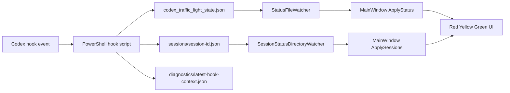

# Codex Traffic Light 项目分析报告

## 1. 项目定位

`codex-traffic-light` 是一个纯本地 Windows 桌面小工具，用悬浮红绿灯窗口显示 Codex 的运行状态。它不直接接入 Codex 内部进程，也不运行服务端，而是通过 Codex hooks 执行 PowerShell 脚本，把 hook 事件写入本地 JSON 文件，再由 WPF 程序通过 `FileSystemWatcher` 监听这些文件并刷新界面。

核心目标可以概括为：

- 用红灯表示 Codex 正在处理用户请求。
- 用黄灯表示 Codex 正在等待权限确认。
- 用绿灯表示 Codex 当前任务结束或处于空闲状态。
- 支持多个 Codex CLI 或 VS Code 插件会话同时运行时的聚合状态和任务列表。
- 保持本地运行，不上传用户数据。

该项目更像一个“Codex hooks 状态可视化器”，不是 Codex 的替代入口，也不是后台守护服务。

## 2. 技术栈和工程结构

项目使用 .NET 8，分为桌面应用、核心库、测试、安装脚本四部分。

```text
src/
  CodexTrafficLight.App/       WPF 桌面窗口、托盘菜单、文件监听、视觉效果
  CodexTrafficLight.Core/      路径、hook 安装、状态文件、会话、设置、统计、更新检查
tests/
  CodexTrafficLight.Tests/     xUnit 单元测试和结构断言测试
installer/
  CodexTrafficLight.iss        Inno Setup 安装脚本
tools/
  codex-light.ps1              Codex 启动包装脚本
  publish-installer.ps1        发布并构建安装包
```

App 项目依赖 Core 项目。Core 项目不依赖 WPF，因此路径、JSON、hook 和统计逻辑可以独立测试。

## 3. 核心实现想法

项目最关键的设计是把 Codex 的生命周期事件转换成本地状态文件：



这个方案有几个好处：

- hook 脚本和 UI 解耦，Codex 只需要能执行命令。
- WPF 程序可以随时启动或退出，不影响 Codex 本身。
- 状态协议是 JSON 文件，容易调试。
- 多个会话可以通过多个 session JSON 文件自然扩展。

代价是状态一致性依赖文件写入和文件监听，且 hook 事件覆盖面受 Codex hooks 事件模型限制。

## 4. Codex hooks 接入

`CodexHookInstaller` 是 hook 接入的核心类。应用启动时会调用：

```csharp
new CodexHookInstaller(_paths).InstallOrUpdate();
```

它会做三件事：

1. 定位 Codex 配置目录。
2. 写入 PowerShell hook 脚本。
3. 修改 `hooks.json`，为指定事件追加红绿灯 hook。

当前注册的事件映射如下：

| Codex 事件 | 写入状态 | 含义 |
|---|---:|---|
| `UserPromptSubmit` | `red` | 用户提交请求，Codex 开始处理 |
| `PermissionRequest` | `yellow` | Codex 请求权限确认 |
| `Stop` | `green` | 本轮任务结束 |
| `SessionStart` | `green` | 会话开始时初始化为空闲 |

安装器会保留用户已有的其他 hooks，只删除并重写自己拥有的命令。判断依据是命令中是否包含：

```text
codex_traffic_light_write_status.ps1
```

这使得安装过程基本幂等，测试里也覆盖了“保留无关 hooks”“重复安装结果一致”“坏 JSON 备份”这些场景。

## 5. 路径和本地文件协议

`CodexPaths` 统一管理本地文件路径。路径优先级是：

1. 如果未显式传入 homeDirectory，优先读取环境变量 `CODEX_HOME`。
2. 如果没有 `CODEX_HOME`，使用 `%USERPROFILE%\.codex`。
3. 测试中显式传入 homeDirectory 时，会使用该目录下的 `.codex`。

主要文件如下：

```text
%CODEX_HOME%\hooks.json
%CODEX_HOME%\codex_traffic_light_state.json
%CODEX_HOME%\codex_traffic_light_settings.json
%CODEX_HOME%\codex_traffic_light_stats.json
%CODEX_HOME%\codex-traffic-light\codex_traffic_light_write_status.ps1
%CODEX_HOME%\codex-traffic-light\sessions\*.json
%CODEX_HOME%\codex-traffic-light\diagnostics\latest-hook-context.json
```

单一状态文件 `codex_traffic_light_state.json` 用于普通红绿灯状态。多会话目录 `sessions` 用于维护每个 Codex 会话的状态。诊断文件记录最近一次 hook 的上下文，便于排查 session 识别失败、cwd 缺失或父进程识别异常。

## 6. hook 脚本逻辑

hook 脚本由 `CodexHookInstaller.EnsureHookScript()` 内联生成。脚本接收两个参数：

```powershell
-State red|yellow|green|unknown
-EventName <event>
```

脚本主要步骤：

1. 计算 Codex 配置目录。
2. 创建 `codex-traffic-light\sessions` 和 `diagnostics` 目录。
3. 从 stdin 读取 Codex hook 输入 JSON。
4. 尝试提取 `session_id`、`conversation_id`、`cwd`、`prompt`。
5. 通过 `Get-CimInstance Win32_Process` 向上查找父进程，识别 Codex CLI 或 VS Code 插件来源。
6. 生成稳定的 session id。
7. 写入全局状态文件。
8. 写入当前 session 的 JSON 文件。
9. 写入诊断 JSON。

session id 的来源按优先级选择：

1. `CODEX_TRAFFIC_LIGHT_SESSION_ID` 环境变量。
2. hook 输入里的 `session_id` 或 `conversation_id`。
3. 父进程 id 加进程启动时间。

`tools/codex-light.ps1` 就是为第一种方式服务的包装器。它在启动 `codex` 前注入：

```powershell
$env:CODEX_TRAFFIC_LIGHT_SESSION_ID
$env:CODEX_TRAFFIC_LIGHT_SESSION_NAME
$env:CODEX_TRAFFIC_LIGHT_TASK_NAME
$env:CODEX_TRAFFIC_LIGHT_WORKING_DIRECTORY
```

这样多项目、多窗口运行时，任务抽屉里能显示更稳定的任务名称和工作目录。

## 7. 状态文件读写

`StatusFileStore` 负责读写全局状态：

```json
{
  "state": "red",
  "event": "UserPromptSubmit",
  "updatedAt": "2026-06-03T12:00:00+08:00"
}
```

写入时采用临时文件加原子替换思路：

```csharp
File.WriteAllText(tempPath, json);
File.Move(tempPath, _paths.StatusPath, overwrite: true);
```

这能降低 UI 读到半个 JSON 的概率。读取失败时不会抛出异常，而是返回 `Unknown` 状态，并用 `missing`、`invalid`、`error` 等 event 标记原因。

这里的设计取向是“状态展示不能影响主流程”。即使状态文件损坏，红绿灯最多显示未知，不会阻断 Codex。

## 8. 文件监听和刷新

App 层有两个 watcher：

- `StatusFileWatcher` 监听全局状态文件。
- `SessionStatusDirectoryWatcher` 监听 `sessions\*.json`。

两者都用 120ms debounce，避免文件系统事件连续触发导致 UI 多次刷新。多会话 watcher 额外有一个 5 秒定时刷新：

```csharp
_refreshTimer = new System.Timers.Timer(TimeSpan.FromSeconds(5))
```

这个定时器很重要，因为会话可见性不仅由文件变化决定，还由“最后更新时间距现在多久”和“进程是否仍存活”决定。即使没有新文件事件，旧会话也应该自动从列表里消失。

## 9. 多会话模型和聚合规则

每个 session JSON 映射到 `CodexSessionStatus`：

```csharp
public sealed record CodexSessionStatus
{
    public string SessionId { get; init; }
    public string DisplayName { get; init; }
    public string WorkingDirectory { get; init; }
    public string Source { get; init; }
    public CodexLightState State { get; init; }
    public string Event { get; init; }
    public int ProcessId { get; init; }
    public DateTimeOffset? ProcessStartTime { get; init; }
    public DateTimeOffset UpdatedAt { get; init; }
}
```

`SessionStatusStore.LoadSessions()` 会执行四步：

1. 读取所有 session JSON，忽略坏文件。
2. 根据状态、更新时间和进程存活情况过滤可见会话。
3. 对弱 session id 按工作目录去重。
4. 按状态优先级和更新时间排序。

可见性规则：

| 状态 | 默认保留时间 | 进程仍存活时 |
|---|---:|---|
| Green | 5 分钟 | 不延长 |
| Yellow | 5 分钟 | CLI 最长 6 小时，VS Code 插件最长 2 小时 |
| Red | 10 分钟 | CLI 最长 6 小时，VS Code 插件最长 2 小时 |

聚合状态优先级：

```text
Yellow > Red > Green > Unknown
```

也就是说只要有一个会话在等权限，主灯就是黄灯；否则只要有一个会话在处理，主灯就是红灯；全部完成才显示绿灯。

这个优先级很符合实际使用：等待权限确认比后台思考更需要用户立即看到。

## 10. UI 实现

桌面端使用 WPF，主窗口是无边框、透明背景、置顶、隐藏任务栏图标的悬浮窗：

```xml
WindowStyle="None"
ResizeMode="NoResize"
AllowsTransparency="True"
ShowInTaskbar="False"
Topmost="True"
```

`App.xaml.cs` 使用命名 Mutex 保证单实例：

```csharp
new Mutex(true, "Local\\CodexTrafficLight.SingleInstance", out _ownsMutex)
```

主界面分为：

- 红黄绿灯主体。
- 齿轮按钮。
- 多会话数量徽标。
- 设置面板。
- 多会话任务抽屉。

视觉上每个灯由三层组成：

- `Well`：灯槽背景。
- `Lamp`：实际灯珠。
- `Ring`：脉冲光圈。

动画策略：

- 红灯使用呼吸动画，表达“正在处理”。
- 黄灯和绿灯使用参考脉冲。
- 设置中可以切换常亮或呼吸/脉冲，并调整速度。

窗口位置会保存到设置文件。主题、单灯/三灯样式、置顶、是否显示已结束会话、黄灯自动展开抽屉等也会持久化。

## 11. 托盘菜单和用户操作

项目使用 Windows Forms `NotifyIcon` 提供托盘菜单。菜单能力包括：

- 显示或隐藏窗口。
- 手动切换红灯、黄灯、绿灯。
- 切换单灯/三灯样式。
- 查看 hooks 配置路径。
- 重新写入 hooks。
- 切换深浅色主题。
- 开关黄灯自动展开任务列表。
- 显示或隐藏已结束会话。
- 清理已完成会话。
- 查看本周周报。
- 检查更新。
- 关于和设置。
- 退出程序。

手动切灯会写入全局状态文件，并用 event `manual` 标记。`ApplyStatus()` 会跳过 `manual` 和 `app-start` 的统计，避免手动调试污染周报。

## 12. 统计和周报

`StatsStore` 按日期聚合三类数据：

```csharp
public sealed record DailyStats
{
    public int RedCount { get; init; }
    public int GreenCount { get; init; }
    public long RedDurationMs { get; init; }
}
```

统计逻辑只在状态变化时记录：

- 进入 Red 时，`RedCount + 1`。
- 从 Red 进入 Green 时，`GreenCount + 1`，并累计 Red 持续时间。
- Yellow 和 Unknown 不增加计数。

周报按当前日期所在自然周的周一到周日读取数据，展示思考次数、回复次数和红灯总时长。

这个统计是轻量的本地近似统计。它把“红灯持续时间”视为 Codex 工作时间，但在多会话聚合场景下，它记录的是聚合主灯状态，不是每个 session 的独立耗时。

## 13. 更新检查和发布

更新检查由 `UpdateChecker` 负责，只有用户主动点击“检查更新”时才会请求远程 `version.json`。当前代码使用固定 URL：

```text
https://raw.githubusercontent.com/Novsco12Gao/codex-traffic-light/main/version.json
```

安全约束：

- manifest URL 必须是 HTTPS。
- 下载 URL 必须是 HTTPS。
- 版本号只能是 2 到 3 段数字版本。
- notes 最多取 8 条。
- 请求失败时静默返回失败结果，不抛出到 UI。

打包脚本 `tools/publish-installer.ps1` 先执行 `dotnet publish`，再查找 Inno Setup 的 `ISCC.exe` 生成安装包。没有 Inno Setup 时会输出已发布文件目录并用退出码 2 结束。

## 14. 测试覆盖情况

测试项目使用 xUnit，覆盖面较实用：

- `CodexPathsTests`：验证 `CODEX_HOME` 和显式 homeDirectory 的路径规则。
- `StatusFileStoreTests`：验证状态文件读写、缺失和坏 JSON 处理。
- `SessionStatusStoreTests`：验证多会话排序、聚合、过期隐藏、进程存活延长、弱 session 去重、完成进度。
- `StatsStoreTests`：验证红灯次数、绿灯次数、红灯持续时间。
- `AppSettingsStoreTests`：验证设置默认值和持久化。
- `CodexHookInstallerTests`：验证 hook 安装保留无关配置、幂等、坏 JSON 备份、脚本内容包含关键逻辑。
- `UpdateCheckerTests`：验证更新可用、无更新、非法 manifest、远程失败。
- `InstallerScriptTests` 和 `AppVisualStyleTests`：通过文本断言约束安装脚本和 UI 结构。

整体看，Core 层逻辑测试较充分。UI 行为本身没有自动化窗口测试，更多是结构和字符串断言。

## 15. 项目的关键设计取舍

### 15.1 文件协议代替 IPC

项目没有使用 named pipe、socket 或 Windows message，而是使用 JSON 文件。这降低了实现复杂度，也方便用户排查，但实时性和一致性依赖文件系统事件。

这个取舍适合当前需求，因为状态变化频率低，红绿灯显示不需要毫秒级精度。

### 15.2 hook 脚本内联生成

PowerShell 脚本被硬编码在 C# 字符串中，由程序写入 Codex 配置目录。这样安装简单，不需要额外部署脚本文件。但代价是：

- 脚本较长，可读性下降。
- PowerShell 逻辑不容易独立 lint 或格式化。
- 修改脚本时 C# 文件 diff 很大。

如果后续脚本继续增长，可以考虑把脚本作为嵌入资源或独立模板文件。

### 15.3 多会话优先级聚合

主灯不展示“平均状态”，而是展示最高优先级状态。黄灯优先级最高，是面向用户注意力的设计。这个选择符合工具定位：红绿灯不是日志面板，而是提醒工具。

### 15.4 容错优先

大多数读文件、解析 JSON、检查更新的异常都被吞掉并返回默认状态。这样不会因为辅助工具异常影响用户用 Codex。但代价是问题可能被隐藏，需要依赖 diagnostics 文件和测试定位。

## 16. 已发现的问题和风险

### 16.1 源文件中文文本疑似编码损坏

当前仓库中 README、XAML、C# UI 文本、Inno Setup 文本和部分测试断言显示为乱码，例如 `Codex 绾㈢豢鐏?`。这不是运行架构问题，但会影响：

- 用户看到的窗口文字、托盘菜单、设置界面。
- README 可读性。
- 测试断言可维护性。
- 安装器显示文本。

建议单独做一次编码修复，把所有中文文案统一恢复为 UTF-8，并更新测试断言。

### 16.2 hook 脚本和 C# 代码耦合较重

`CodexHookInstaller.cs` 同时承担 JSON 合并和 PowerShell 脚本模板维护。脚本越长，维护成本越高。更好的拆分方式是：

- C# 负责安装和参数化。
- PowerShell 脚本作为资源文件保存。
- 测试校验资源内容和安装结果。

### 16.3 统计口径是聚合状态，不是会话级状态

多会话时 `RecordStatsState()` 记录的是聚合主灯变化。如果两个任务同时运行，红灯时间不会拆分到各任务。当前周报用于粗略观察没问题，但不能解释为严格的 Codex 总工作量。

### 16.4 `StatusFileWatcher` 和 `SessionStatusDirectoryWatcher` 的异常处理有限

watcher 创建时会主动创建目录，正常情况下没问题。但如果配置目录权限异常、路径不可用、文件系统 watcher 失效，UI 可能没有明确提示。后续可以把 watcher 初始化失败显示到诊断或托盘菜单中。

### 16.5 手动切灯只写全局状态，不写 session 状态

当 `_visibleSessions.Count > 0` 时，`ApplyStatus()` 会直接返回，主灯由 session 聚合决定。因此在多会话存在时，托盘菜单的手动切灯可能不会立刻改变主灯。这符合“多会话优先”的逻辑，但用户可能不易理解。

### 16.6 更新地址硬编码

更新 manifest URL 写死在 `MainWindow.xaml.cs`。如果仓库迁移或发布源变化，需要改代码重新发布。可以考虑放进 `version.json` 或应用设置，但当前规模下不是严重问题。

## 17. 可维护性评价

项目的核心模型是清楚的：

```text
Codex hooks -> PowerShell -> JSON 文件 -> watcher -> WPF UI
```

Core/App 分层基本合理。Core 中的路径、状态、会话、统计和更新检查都可以单测，这对小型桌面工具来说是比较好的工程质量。

主要可维护性压力来自两个地方：

- 中文文案编码损坏。
- PowerShell hook 脚本以内联大字符串形式存在。

如果修复这两个问题，项目后续扩展空间会更好。

## 18. 后续改进建议

建议优先级如下：

1. 修复中文编码和 UI 文案，保证 README、菜单、设置、安装器和测试断言全部可读。
2. 将 hook PowerShell 脚本移出 C# 大字符串，改为嵌入资源或模板文件。
3. 在设置或关于窗口中增加诊断入口，直接打开 `latest-hook-context.json` 所在目录。
4. 增加 watcher 初始化失败和 hook 未信任状态的可见提示。
5. 区分全局状态统计和会话级统计，避免周报在多会话场景下产生误解。
6. 给 `codex-light.ps1` 增加更明确的帮助输出，例如 `-Help` 参数。
7. 如果项目继续发布给外部用户，增加一条端到端手工验证清单：安装、信任 hooks、CLI 触发红灯、权限请求触发黄灯、Stop 触发绿灯、多会话抽屉。

## 19. 总结

这个项目的核心思路是用 Codex hooks 做事件源，用本地 JSON 文件做轻量 IPC，用 WPF 悬浮窗做状态呈现。它的架构简单、边界清楚、失败影响小，非常适合作为本地辅助工具。

最值得保留的设计是：

- hooks 和 UI 解耦。
- 状态协议基于本地文件，便于调试。
- 多会话以 session 文件扩展。
- 黄灯优先的聚合策略符合用户注意力模型。
- Core 层有比较完整的单元测试。

最需要尽快处理的问题是中文文本编码损坏和 hook 脚本内联过长。前者影响用户体验，后者影响长期维护。
